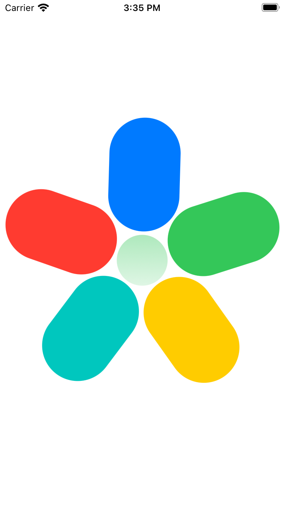

# BloomMenu 

I crafted this project during my SwiftUI animation learning path, exploring the use of animation and gesture features. I was inspired by [PetalMenu's project](https://github.com/bodhichristian/PetalMenu).

## Screenshots 🌃
close menu           |  open menu                      |  semi open menu
:-------------------------:|:-------------------------:|:-------------------------:
||

## The tech stack used in this project 🛠

- SwiftUI
- Animation (spring)
- DragGesture

## Tools
- Xcode 14.3.1
- Swift 5.8.1

## Usage

1. Clone the repository:

  ``` bash
    git clone https://github.com/helloItsHEssam/BloomMenu.git
  ```

###  Contributing 🤝

Contributions, issues, and feature requests are welcome! Feel free to fork the repository and submit a pull request with your changes.

## License

Please check [LICENSE](LICENSE) for details.